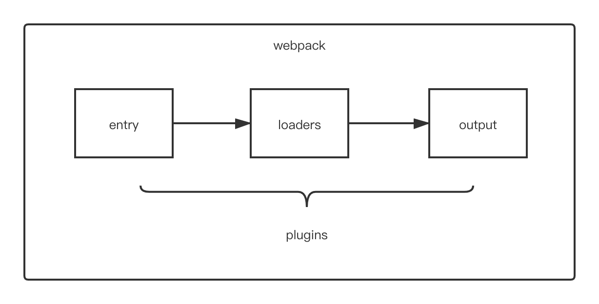

# webpack

[TOC]

## 1、webpack 是什么？

- 官⽅方⽹网站:https://webpack.js.org/
- 中⽂文⽹网站:https://www.webpackjs.com/


本质上，`webpack` 是一个现代 `JavaScript` 应用程序的静态模块打包器(module bundler)。当 webpack 处理应用程序时，它会递归地构建一个依赖关系图(dependency graph)，其中包含应用程序需要的每个模块，然后将所有这些模块打包成一个或多个 bundle。


## 2、安装

`webpack` 是一个使用 `Node.js` 实现的一个模块化代码打包工具。所以，我们需要先安装 webpack，安装之前需要搭建好 `Node.js` 环境

```shell
 npm install -D webpack webpack-cli
```

> 注：不推荐全局安装

`webpack-cli` : 提供 webpack 命令、工具，类似 `create-react-app`

`webpack` : webpack 代码，类似 `react`


## 3、使用

```bash
./node_modules/.bin/webpack

// 查看版本
./node_modules/.bin/webpack -v
```

也可以编辑 `package.json` 的 `scripts` 来简化输入

```json
// package.json
{
	...,
	"scripts": {
		"start": "webpack"	// scripts 中可以定位到 ./node_modules/.bin/ 目录下
	}
}
```

> `scripts` 中使用 `test`、`start`、`restart`、`stop` 命名的时候，可以在调用的时候省略 `run`，即直接 `npm start`

当然，还可以使用更加方便的方式：

```bash
npx webpack
```

通过 `npx` 也可以帮助我们定位命令到 `./node_modules/.bin/` 目录下

> 注：npm5.2+ 增加，如果没有，可以使用 npm i -g npx 来安装


## 4、打包模块

打包之前，我们需要了解一个概念，入口文件

### 4-1、入口文件

入口文件就是我们项目中加载的第一个文件，比如上面的 `main.js` 文件，其它文件都是通过 `import` 等方式引入的，`webpack` 会从我们指定的入口文件开始分析所有需要依赖的文件，然后把打包成一个完整文件。

### 4-2、打包命令

```bash
webpack ./js/index.js
```

上面命令会使用 `webpack` 默认的一些配置对模块文件进行打包，并把打包后的文件输出到默认创建的 `./dist` 目录下，打包后的文件名称默认为 `main.js`。

模块文件打包以后，就可以在不支持 es6 模块语法的浏览器环境下引入使用了。

**打包文件分析**

- 把分散的模块文件打包到一个文件中，不需要外部引入了
- 内置了一个小型模块加载器(类似 `requireJS`)，实现了打包后的代码隔离与引用

以上就是 webpack 最基础的使用于基本原理，当然强大的 `webpack` 远远不止这些功能。


## 5、打包配置

虽然，我们可以直接通过命令的来打包，但是推荐创建一个 `webpack.config.js` 的配置文件来实现更方便和强大的功能。

`webpack` 命令在运行的时候，默认会读取运行命令所在的目录下的 `webpack.config.js` 文件，通常我们会在项目的根目录下运行命令和创建配置文件。

我们也可以通过 `—config` 选项来指定配置文件路径：

```shell
webpack --config ./configs/my_webpack.config.js
```

通常情况下，我们的项目目录大致如下：

```txt
/
-- /dist - 项目打包后存放目录
-- /node_modules - 第三方模块
-- /src
------ css/
------ images/
------ js/
------ index.js
-- webpack.config.js
-- package.json
```

配置文件

```javascript
module.exports = {
  ...	//配置项
}
```


## 6、核心配置

### 6-1、mode

模式 : `"production" | "development" | "none"`

不同的模式会对 `webpack` 打包的时候进行一些对应的优化配置。

```bash
module.exports = {
  mode: 'production'
}
```

### 6-2、entry

指定打包⼊口⽂文件，有三种不同的形式：`string | object | array`

<!--一对一：一个入口、一个打包文件-->

```js
module.exports = {
  entry: './src/index.js'
}
```

<!--多对一：多个入口、一个打包文件-->

```js
module.exports = {
  entry: [
    './src/index1.js',
    './src/index2.js',
  ]
}
```

<!--多对多：多个入口、多打包文件-->

```js
module.exports = {
  entry: {
    'index1': "./src/index1.js",
    'index2': "./src/index2.js"
  }
}
```

### 6-3、output

打包后的文件位置

```js
module.exports = {
  ...,
  output: {
  	path: path.resolve(__dirname, "dist"),
    filename: "bundle.js",
		filename: "[name].js"
	}
}
```

- 可以指定一个固定的文件名称，如果是多入口多出口(`entry` 为对象)，则不能使用单文件出口，需要使用下面的方式
- 通过 `webpack` 内置的变量占位符：`[name]`


## 7、深入

在 `webpack` 中，有一个很重要的特性：模块不仅仅只是 `js` 的文件，`webpack` 可以把任意文件数据作为模块进行处理，包括：非 js 文本、css、图片等等

```javascript
import txt from './a.txt';
console.log(txt);
```

但是 `webpack` 默认情况下只能处理 `js` 模块，如果需要处理其它类型的模块，则需要使用它提供的一些其它功能

### 7-1、执行简要流程



- `loaders`：`webpack` 中灰常核心的内容之一，前面我们说的非 js 类型的模块处理就靠它了。webpack 可以使用 loader 来预处理文件。这允许你打包除 JavaScript 之外的任何静态资源。你可以使用 Node.js 来很简单地编写自己的 loader。
- `plugins`：`webpack` 中另外一个核心的内容，它主要是扩展 `webpack` 本身的一些功能。插件可以运行在 `webpack` 的不同阶段（钩子 / 生命周期）。


## 8、Loaders

https://webpack.js.org/loaders/

```js
module.exports = {
  ...,
  module: {
  	rules:[
  		{
  			test:/\.xxx$/,
       	use:{
        	loader: 'xxx-load'
      	}
			}
  	]
	}
}
```

当 `webpack` 碰到不识别的模块的时候，`webpack` 会在配置的 `module` 中进行该文件解析规则的查找

- `rules` 就是我们为不同类型的文件定义的解析规则对应的 loader，它是一个数组
- 每一种类型规则通过 test 选项来定义，通过正则进行匹配，通常我们会通过正则的方式来匹配文件后缀类型
- `use` 针对匹配到文件类型，调用对应的 `loader` 进行处理

**从一个简单的案例来了解 loader**

<!--src/datas/data.txt-->

```
我是 txt 的内容
```

<!--src/datas/data.md-->

```
# 我是 md 的内容
```

<!--src/raw-loader.js-->

```javascript
import txtData from './datas/data.txt';
import mdData from './datas/data.md';

console.log('txtData: ', txtData);
console.log('mdData: ', mdData);
```

默认情况下，webpack 会报错，因为 webpack 处理不了 txt 和 md 这样的非 js 的模块，但是我们可以通过专门来处理纯文本内容(不同的 loader 有不同的作用)

### 8-1、raw-loader

在 webpack 中通过 import 方式导入文件内容，loader 并不是 webpack 内置的，所以首先要安装

```bash
npm install --save-dev raw-loader
```

然后在 webpack.config.js 中进行配置

```javascript
module.exports = {
  ...,
  module: {
      rules: [
      {
        test: /\.(txt|md)$/,
        use: 'raw-loader'
    	}
    ]
	}
}
```

### 8-2、file-loader

把识别出的资源模块，移动到指定的输出⽬目录，并且返回这个资源在输出目录的地址(字符串)

```bash
npm install --save-dev file-loader
```

```javascript
rules: [
  ...,
	{
		test: /\.(png|jpe?g|gif)$/,
    use: {
      loader: "file-loader",
      options: {
        // placeholder 占位符 [name] 源资源模块的名称
        // [ext] 源资源模块的后缀
        name: "[name]_[hash].[ext]",
        //打包后的存放位置
        outputPath: "./images"
        // 打包后文件的 url
        publicPath: './images',
      }
    }
	}
]
```

> 占位符：https://webpack.js.org/loaders/file-loader#placeholders

### 8-3、url-loader

可以处理理 `file-loader` 所有的事情，但是遇到图片格式的模块，可以选择性的把图片转成 `base64`  格式的字符串，并打包到 `js` 中，对⼩体积的图片⽐较合适，⼤图⽚不合适。

```bash
npm install --save-dev url-loader
```

```javascript
rules: [
  ...,
	{
		test: /\.(png|jpe?g|gif)$/,
    use: {
      loader: "url-loader",
      options: {
        // placeholder 占位符 [name] 源资源模块的名称
        // [ext] 源资源模块的后缀
        name: "[name]_[hash].[ext]",
        //打包后的存放位置
        outputPath: "./images"
        // 打包后文件的 url
        publicPath: './images',
        // 小于 100 字节转成 base64 格式
        limit: 100
      }
    }
	}
]
```

### 8-4、css-loader

分析 `css` 模块之间的关系，并合成⼀个 `css`

```bash
npm install --save-dev css-loader
```

```js
rules: [
  ...,
	{
		test: /\.css$/,
    use: {
      loader: "css-loader",
      options: {
  			// 启用/禁用 url() 处理
  			url: true,
  			// 启用/禁用 @import 处理
  			import: true,
        // 启用/禁用 Sourcemap
        sourceMap: false
      }
    }
	}
]
```

### 8-5、style-loader

把 `css-loader` 生成的内容，用 `style` 标签挂载到⻚面的 `head` 中

```bash
npm install --save-dev style-loader
```

```js
rules: [
  ...,
	{
		test: /\.css$/,
    use: ["style-loader", "css-loader"]
	}
]
```

同一个任务的 `loader` 可以同时挂载多个，处理顺序为：从右到左，也就是先通过 `css-loader` 处理，然后把处理后的 `css` 字符串交给 `style-loader` 进行处理

```js
rules: [
  ...,
	{
		test: /\.css$/,
    use: [
  		{
  			loader: 'style-loader',
  			options: {}
  		},
      'css-loader'
		]
	}
]
```
